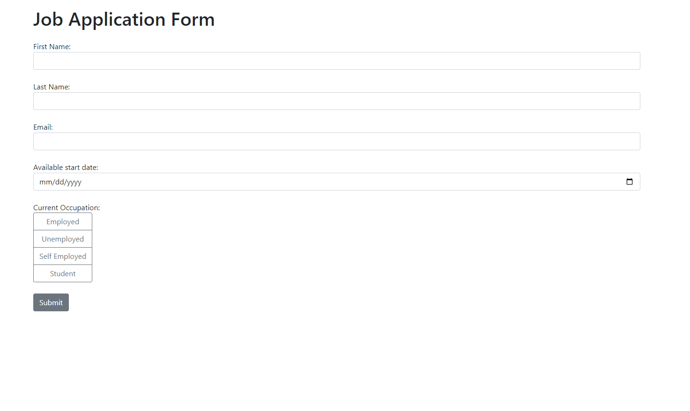

# About this repository
This is a simple job application app built using Flask in Python and HTML.

## Features
- The user can navigate to `About` and `Contact` pages
- The app sends a confirmation mail with a copy of the supplied details on the mail specified in the form

# How to run
After cloning it to a local directory, the web app can be launched using :
<code>py -3 main.py</code> (for windows)
<code>python3 main.py</code> (for mac/linux)

The website can be accessed at http://127.0.0.1:5001

## Dependencies
<pre>
blinker==1.6.2
click==8.1.7
colorama==0.4.6
Flask==3.0.0
Flask-Mail==0.9.1
Flask-SQLAlchemy==3.1.1
greenlet==3.0.0
itsdangerous==2.1.2
Jinja2==3.1.2
MarkupSafe==2.1.3
SQLAlchemy==2.0.21
typing_extensions==4.8.0
Werkzeug==3.0.0
</pre>

The `requirements.txt` file is also included